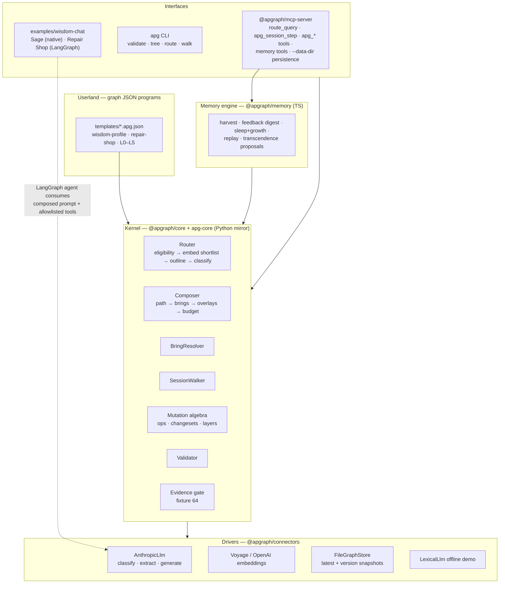
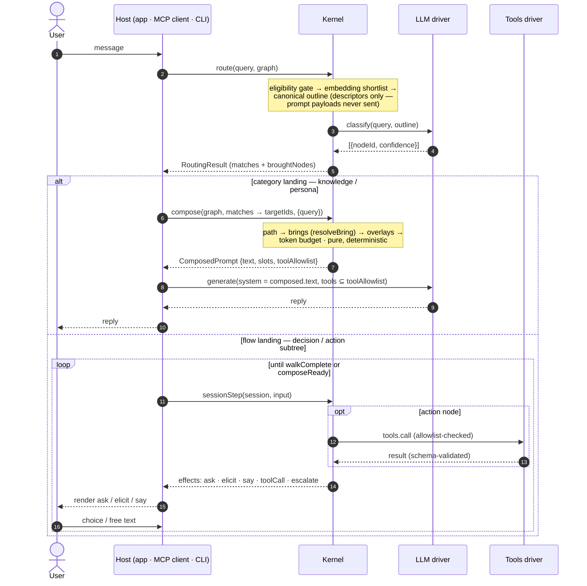
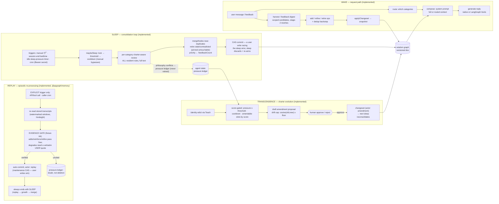

# APG system architecture

How the pieces fit, and where each learning loop runs. Companion docs:
[`spec/determinism.md`](spec/determinism.md) (pinned kernel semantics),
[`known-concerns.md`](known-concerns.md) (audited limitations and their status).

## Layering (the OS analogy, as built)

The conformance suite (64 fixtures in `schema/conformance/`) is the contract between the two
kernel runtimes: a behavior change without a fixture change is a bug by definition.

## The kernel request path — route → resolve → compose → walk → effects

The per-message cycle. Each verb is an exported kernel function — effects are the walk's
output contract with the host — and the same verbs surface as CLI subcommands and MCP tools:

| Verb | Function | Decides | CLI | MCP tool |
|---|---|---|---|---|
| **Route** | `route(query, graph, {connectors})` — `router.ts` | *Where does this query belong?* Eligibility gate → optional embedding shortlist → canonical outline → one classify call → confidence gate + tie-break → fallback ladder | `apg route` | `route_query` |
| **Resolve** | `resolveBring(graph, landingId)` — `bring.ts` | *What does this answer need?* BFS over `bring[]` edges, cycle-safe, depth-capped, tenant-checked | — | `apg_resolve_bring` |
| **Compose** | `compose(graph, targetIds, opts)` — `compose.ts` | *What is the prompt?* Path → brings/secondaries → overlays → token budget. Pure function, zero selection | `apg compose` | `apg_compose_preview` |
| **Walk** | `sessionStep(graph, session, input, connectors)` — `session.ts` | *What happens next?* Deterministic stepping over decision/action/answer nodes, emitting effects | `apg walk` | `apg_session_step` |
| **Effects** | `SessionEffect[]` — the walk's return is `{session, effects}` | *Who acts?* The kernel's instructions to the host: `ask · elicit · say · toolCall · escalate · composeReady · walkComplete · reroute`. The kernel decides; the host acts — rendering questions, opening tickets, calling generate | rendered by the `apg walk` REPL | in the `apg_session_step` result |

Three contracts make the cycle cheap and portable:

- **The router never sees prompt payloads.** The classifier receives the canonical outline —
  one line per eligible node, descriptor fields only (`title`/`description`/`aliases`, or the
  graph's `defaults.routing.descriptor`, e.g. `["title","props.learn"]`). Prompt slots, brings,
  and flow blocks are never rendered; embeddings likewise embed descriptor text only, never
  prompts. Bulky knowledge leaves are stored `routable:false` so they never widen the outline.
  The outline is byte-stable, so it doubles as the route-cache key.
- **Route's output is compose's input.**
  `compose(graph, routing.matches.map(m => m.nodeId), {query})` — the first match is the
  primary target (its root→leaf path supplies persona/task/constraints); the rest ride as
  context-only secondaries. `resolveBring` is the connective verb: route calls it to report
  `broughtNodes`, compose calls it again in stage 2 to pull the content. All model judgment
  lives in route; compose is deterministic and cacheable.
- **Walk interprets flow in-kernel; generation stays external.** The graph language includes
  flow edges (guards, choices, `collect`, escalation), so the kernel must ship the interpreter
  — otherwise every host reimplements it and the same graph behaves differently per deployment
  (15 of the 64 fixtures pin walker behavior). The walker returns *effects*
  (`ask`/`elicit`/`say`/`toolCall`/`escalate`/`composeReady`/`walkComplete`); the host renders
  questions, supplies answers, and owns generation. Category landings skip walk entirely:
  route → resolve → compose → *generate* (host LLM).

Worked traces: a Repair Shop message ("quote me an impeller swap") routes to `quotes`, brings
shop-facts plus learned rules, and composes the system prompt LangGraph runs with
allowlist-filtered tools — route → resolve → compose → generate, no walk. A triage message
("my phone won't start") routes into the `wont-start` decision subtree and walks: ask →
choice → elicit serial number → tool call → answer → `walkComplete` (this exact trace is
pinned in the MCP server test).

## The learning loops — wake and sleep

The wisdom graph learns on three timescales, deliberately split between a fast **wake path**
(in the request path: local, scoped, cheap) and an offline **sleep path** (global, periodic,
expensive). The split exists for the same reason biological memory splits encoding from sleep
consolidation: you cannot globally reorganize memory while serving live traffic without
interference — so global reorganization runs off the hot path.

All writes — wake, sleep, amendment — flow through one safe-write layer: a per-agent in-process
lock plus app-level compare-and-swap (`ConflictError` when the base version moved; user-initiated
writes retry against fresh, maintenance aborts), atomic temp+rename file writes, and a unified
`audit.jsonl` recording every mutation with actor and version chain.

| Loop | Timescale | Analogy | Mechanism | Status |
|---|---|---|---|---|
| Per-message context | instant | attention | route → compose (full/routed toggle) | implemented |
| Harvest / feedback digest | per 5 msgs / per teach | waking encoding | extract → add/refine/retire ops, scoped candidates | implemented |
| **Consolidation** | periodic ("nightly") | **sleep**: replay, schema extraction, synaptic downscaling | per-category review → `mergeNodes` / retire / re-rank via changesets | **implemented** (`src/lib/consolidate.ts`) |
| Taxonomy mutation ("deep sleep") | on misfit-pool saturation | schema accommodation | cluster misfits → named new categories → **regression-gated lifecycle changeset** → 🌱 human approval | implemented (`src/lib/grow.ts`, `@apgraph/memory`) |
| **Transcript replay** | explicit trigger / caller cron only | hippocampal replay: episodes → schema with hindsight | re-read raw transcripts → **evidence-gated** batch (degrades need a verbatim user quote; uncited → pressure ledger) → auto-commit actor `replay` → always ends with sleep | implemented (`@apgraph/memory` `runReplay`, fixture 64) |

## Consolidation loop (implemented — `examples/wisdom-chat/src/lib/consolidate.ts`)

Write-time hygiene (refine-over-add, dedup backstop) is an insert-time check — it never
re-examines residents against each other, its candidate window is routing-scoped by design, and
staleness is undecidable at write time ([known-concerns #3](known-concerns.md)). Consolidation
is the maintenance pass that closes those gaps:

- **Trigger**: a category's learning count ≥ threshold (default 6) surfaces a "consolidation
  recommended" state; run via `POST /api/consolidate` (manual button, cron-able).
- **Review call** (one per qualifying category, off the chat path): receives every resident
  rule at full text with `feedbackCount`/`learnedAt`/`source`; returns
  `{merges: [{keepId, absorbIds, mergedText, label}], retires: [{id, reason}], priorities: [{id, weight}]}`.
- **Ops mapping**: merges → `updateNode(keepId, mergedText+label)` + `mergeNodes(absorbIds → keepId)`
  (unions brings/aliases and rewrites seeAlso references graph-wide — already conformance-pinned);
  retires → the digest's retire op-set; priorities → `composition.priority` derived from
  `feedbackCount`, so reinforced rules outlive one-offs under token-budget truncation (closes
  known-concerns #6 for consolidated categories).
- **Safety**: one changeset per category (bounded blast radius, atomic, validated,
  version-snapshot per run), plus an append-only `consolidations.jsonl` audit log; "before
  sleep" is always recoverable by version.
- **Coordination rule learned building this** (pinned by the app's vitest suite): with multiple
  removals in one changeset, per-node `setBring` ops computed from the pre-changeset snapshot
  clobber each other — removal must be a SET operation emitting one final array per affected
  anchor (`removalOps` in `src/lib/wisdom.ts`), with adds excluded/ordered after.
- **Ordering rule learned live-driving deep sleep**: growth must cluster the RAW misfit
  episodes BEFORE light sleep compresses them — schema extraction precedes synaptic
  downscaling, or the merge pass destroys the very signal clustering needs ("light sleep eats
  deep sleep"). `consolidate()` therefore runs `maybeGrow` first against the pre-compression
  graph, and when a growth draft is produced the misfit pool is exempt from that cycle's merge
  pass so approval can still move the original nodes; when growth declines, ordinary
  consolidation reclaims the pool.
- **Later tier**: a cross-category pass over labels only (contradictions that span categories),
  and true "replay" — re-processing raw session transcripts rather than distilled rules.

## Transcendence (implemented — `examples/wisdom-chat/src/lib/transcend.ts`)

When learned evidence and the root charter (the agent's identity / life philosophy) conflict,
**the transcendence score decides which side yields.** At score 0 the charter is a constitution —
leaves conform to it, proposals are disabled. As the score rises, sustained conflict pressure may
amend the charter itself. One dial, five derived reins (each overridable via graph
`meta.memory.transcendence`):

| score | amendable slots | pressure threshold | drift floor (min cosine old↔new) |
|---|---|---|---|
| 0 | none — constitution | ∞ | — |
| (0, .34] | constraints | 8 | 0.90 |
| (.34, .67] | + task | 5 | 0.70 |
| (.67, 1] | + persona | 3 | 0.50 |

Mechanics: sleep reviews are charter-aware and report `philosophyConflicts` — **logged to the
pressure ledger, never auto-retired** (learned data is sacrosanct outside explicit ops). Ledger ≥
threshold (or an explicit identity **edict** via feedback) → an amendment proposal: minimal
revised slot texts, rationale, evidence attached. The **drift cap** measures similarity between
old and new text (embeddings when a vector key is bound, normalized-Levenshtein fallback
otherwise) — identity may travel far, but only in small, individually-audited steps. **Every
proposal is a draft requiring human approval at any score**; approval leaves the identity hash
deliberately stale so the *next sleep runs a reconsolidation review* of all rules against the new
charter. Invalidation is conservative: a draft whose charter moved underneath it never applies.
Rejection dismisses the evidence (charter stands, no instant re-proposal).

Defaults: Sage 0.6, Repair Shop 0.1. Demo pacing via `SLEEP_IDLE_MS`, `SLEEP_COOLDOWN_MS`,
`AMEND_COOLDOWN_MS`; cron via `POST /api/consolidate` with optional `CONSOLIDATE_SECRET`.
