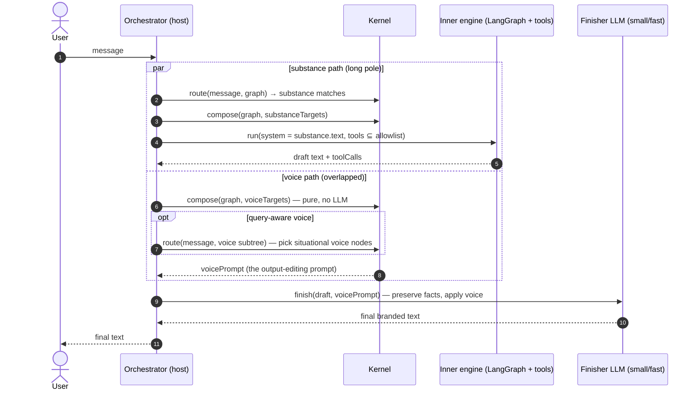

# Voice finisher — a parallel output-shaping channel

**Status: design / candidate** (roadmap next-tier). Companion docs:
[`architecture.md`](architecture.md) (the request path this extends),
[`spec/learning-conventions.md`](spec/learning-conventions.md) (slot/storeAs contracts).

## The idea in one paragraph

Split a wisdom graph's content into two channels: **substance** (task knowledge, facts,
tools — what the answer says) and **voice** (tone, style, brand, "soul" — how the answer
sounds). The substance channel composes the inner engine's system prompt exactly as today.
The voice channel composes a separate **output-editing prompt**, prepared *in parallel*
with the inner run rather than in series before it. When the inner engine (LangGraph, a
native loop, or any text-producing pipeline) returns its draft, a final **finisher** call
at the orchestrator applies the voice prompt to the draft and emits the branded text:

```
final = finish(voicePrompt ∥ innerRun(substancePrompt, tools))
```

The wisdom graph stops being only the inner agent's memory and becomes a **voice control
plane over arbitrary pipelines** — anything that produces text can be given a learnable,
feedback-tuned, versioned character.

## Use case

- **Brandable / white-label agents.** One substance graph (the repair shop's knowledge,
  tools, pricing), N voice branches — each tenant ships its own character. Swapping brands
  is swapping a subtree, not re-prompting an agent.
- **A learnable "soul" that survives engine swaps.** Voice lives in the graph, not in the
  inner framework's prompt. Replace LangGraph with a raw tool-runner or another model and
  the character is untouched — the finisher doesn't care where the draft came from.
- **Style feedback that cannot break substance.** 👎 "too chatty, drop the exclamation
  marks" refines a voice node; it can never perturb tool selection, task triage, or facts,
  because those compose into a different prompt for a different call. The converse holds:
  substance learning never dilutes the voice.
- **Consistent character across heterogeneous outputs.** Tool summaries, walk-path `say`
  effects, escalation messages — every user-facing string can pass the same finisher, so
  the agent has one voice regardless of which code path produced the text.
- **Compliance/postural passes ride free.** The same finisher slot carries per-brand
  disclaimers ("estimates pending inspection, tax extra") — standing output obligations
  enforced at the last responsible moment instead of hoped-for in every inner prompt.

## Why parallel — the performance argument

Today (wisdom-chat shop agent), voice is **in-series and inside the loop**: style rules
compose into the inner system prompt, so (a) style preparation happens before generation
can start, and (b) every iteration of the ReAct loop — every tool round-trip — re-carries
the full style token payload as part of the system prompt.

With the split:

```
T_series   = T_voice_prep + T_inner
T_parallel = max(T_voice_prep, T_inner) + T_finish
```

- `T_voice_prep` (compose, optionally a voice-routing classify) overlaps the inner run
  entirely — it is off the critical path because the inner run is always the long pole.
- The inner loop sheds the style tokens from **every** LLM call it makes: with k loop
  iterations and s style tokens, k×s input tokens are saved and replaced by one finisher
  call that reads them once.
- `T_finish` is one bounded small-model call (the voice branch's `modelHints` can pin a
  fast model, e.g. Haiku) over draft + voice prompt — output-sized input, no tools, no
  history. It adds tail latency; the trade is worth it when brand consistency matters or
  when k×s is large. Make it a per-graph dial (`meta.voice.finisher: "rewrite" | "inline" |
  "off"`), where `"inline"` is today's behavior.

## Architecture



### Graph conventions (userland — no kernel change required)

1. **Channel tagging.** Voice categories carry `props.channel: "voice"`; untagged nodes
   are substance. The orchestrator partitions compose targets by this prop.
2. **Bring isolation — the load-bearing rule.** The voice branch must not be reachable
   from any substance bring chain: the root's `bring[]` carries substance globals only,
   and no substance node brings a voice node. If the root brings `style` (as the
   repair-shop template does today), the substance compose will pull voice content and
   the split silently degrades to double-application. Migrating a graph to this pattern
   means moving the style bring edge off the root and onto the voice channel's own root.
3. **The voice branch programs its own editor.** The voice root's `task` slot holds the
   finisher framing ("You are the final editor. Rewrite the draft in the voice below.
   Preserve every fact, number, price, commitment, and refusal — change only expression."),
   its `constraints` accumulate the learned style rules (feedback digester `storeAs:
   "constraints"`, unchanged), and its `modelHints` pins the finisher model. The graph —
   not app code — defines how its voice is applied, so it stays portable.
4. **Situational voice (optional).** Voice sub-nodes may be `routable: true` with `learn`
   descriptors ("how to sound in emergencies", "how to sound when quoting") — a voice
   routing pass overlapped with the inner run picks them per message. Default: compose
   the whole (small) voice branch, skip routing.

### Orchestrator contract (host)

```ts
const [inner, voice] = await Promise.all([
  runInner(compose(graph, substanceTargets), history, message), // LangGraph etc.
  Promise.resolve(compose(graph, voiceTargets)),                // + optional voice route
]);
const final =
  finisherMode === "rewrite"
    ? await llm.generate({ prompt: voice, query: finishQuery(inner.text), history: [] })
    : inner.text;
```

The finisher sees the draft and the voice prompt — never the tool schemas, never the
session history (unless a graph opts in). Tool calls, effects, and metadata pass through
untouched; only user-facing text is rewritten.

### What the library must support

| Requirement | Verb / mechanism | Status |
|---|---|---|
| Compose an arbitrary subset of the graph | `compose(graph, targetIds)` — already pure, target-driven | exists |
| Partition targets by channel | `props.channel` convention + a `channelTargets(graph, channel)` helper | convention today; helper is a small kernel addition (fixture-pinned in both runtimes) |
| Keep voice out of the substance prompt | bring-isolation (template structure) | template migration per graph |
| Pin the finisher model per graph | `modelHints` on the voice root, surfaced via `ComposedPrompt.modelHints` | exists |
| Learn style into the voice channel | feedback digester `storeAs`/category anchoring — style categories tagged `channel: "voice"` | exists (anchoring already category-scoped) |
| Telemetry parity | `ComposedPrompt.contributors` for the voice pass; per-reply stats gain `finisher ms / tokens` | exists / app-level |
| Charter governance over voice | the voice branch sits under the same root charter; transcendence gating and sleep consolidation apply per category unchanged | exists |

Phase 0 is buildable today with zero kernel changes (hand-pick targets, restructure the
template). Phase 1 adds the `channel` convention + `channelTargets` helper with
conformance fixtures. Phase 2 addresses streaming (below).

## Outcomes

A system with this support gets:

- **Latency**: voice preparation fully overlapped; inner loop k×s style-token savings;
  one bounded small-model finisher on the output path.
- **Isolation**: style learning and substance learning cannot regress each other; style
  A/B and brand versioning become graph-layer operations (swap or layer the voice branch,
  `GraphLayer` already exists).
- **Portability**: the same voice graph brands any inner engine — including pipelines
  that never touch APG for substance. The finisher is the minimal integration surface.
- **Governance**: voice rules remain ordinary graph nodes — audited changesets, sleep
  consolidation, pinning, feedback counts, transcendence pressure — nothing new to build.
- **One voice everywhere**: walk-path `say` effects and tool-result summaries can be
  finished with the same prompt, closing today's gap where only the main generate call
  carries the persona.

## Risks and mitigations

- **Fact drift in the rewrite.** The finisher could alter numbers, commitments, or
  refusals. Mitigations: the preserve-clause in the voice root's `task` framing; low
  temperature; a mechanical post-check that digits/prices/URLs in the draft survive into
  the final text (diff-and-retry once, else fall back to the draft verbatim); safety
  refusals bypass the finisher entirely.
- **Added tail latency on short replies.** A one-line answer pays a full finisher call.
  Dial: `finisher: "inline"` for latency-critical graphs, or a draft-length threshold
  below which the finisher is skipped.
- **Streaming.** Rewriting breaks token-streaming of the inner draft. Phase 2 options:
  stream the finisher itself (user sees branded tokens, total time-to-first-token becomes
  inner-complete + finisher-first-token), or paragraph-chunked finishing. Until then this
  pattern fits non-streaming surfaces (the wisdom-chat UI already renders whole replies).
- **Double application during migration.** If voice content remains reachable from the
  substance bring chain, the character applies twice (inner + finisher) and refinements
  fight each other — hence the bring-isolation rule; a validator lint ("voice-channel node
  reachable from substance bring chain") would catch it structurally.
- **Feedback attribution.** "Don't mention the weather" is substance (tool governance);
  "sound warmer" is voice. The digester's category enum already separates these (style vs
  tool-usage); tagging categories with channels makes the boundary explicit for the
  scoped candidate listing.

## Migration sketch — wisdom-chat repair shop

1. Template: add a `voice` root under `shop` (`props.channel: "voice"`, finisher framing
   in `task`, `modelHints: {model: "claude-haiku-4-5-…"}`); move `style` (and its learned
   leaves `kn-style-*`) under it; **remove `style` from the shop root's `bring[]`**.
2. `chat.ts`: partition targets by channel; `Promise.all` the LangGraph run and the voice
   compose; add the finisher generate; extend `contextStats` with
   `{finisherMs, finisherTokens, voiceNodes}` so the stats badge shows the overlap win.
3. Feedback path: unchanged — style feedback already anchors under `style`; it now lands
   in the voice channel by construction.
4. The 🧪 test harness gains a script: teach a voice rule → expect the *voice* compose to
   change and the substance prompt's char count to stay flat — the isolation is directly
   observable in the stats line.

## Open questions

- Should `channelTargets` be kernel (fixtures, both runtimes) or stay a host helper until
  a second host needs it?
- Does the finisher deserve a `SessionEffect` (`finish` effect emitted at `composeReady`/
  `walkComplete`) so walk-path hosts apply voice uniformly without bespoke code?
- Multi-voice composition (base brand ⊕ seasonal overlay) — plain `GraphLayer` over the
  voice branch, or an ordered voice-bring chain with priorities?
- Should the mechanical fact-preservation check live in the library (it is engine-shaped:
  deterministic, testable, host-independent)?
